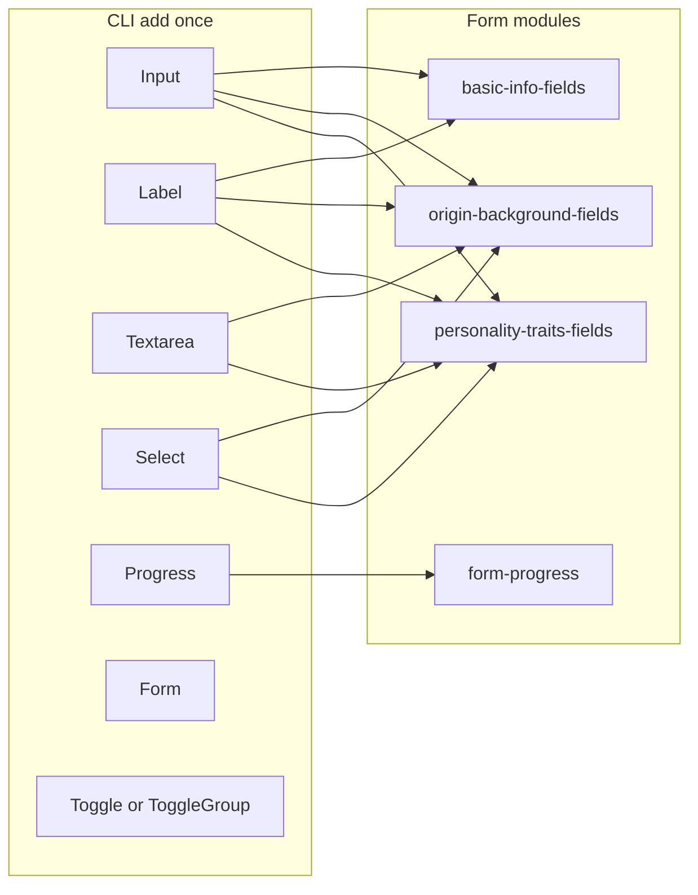

# shadcn/ui adoption plan (Meu Background)

## Current state

- **Already on shadcn stack:** [components.json](d:\GitHub\Meu-Background\components.json) (`style: base-nova`, `cssVariables`, Lucide). [button.tsx](d:\GitHub\Meu-Background\src\components\ui\button.tsx) uses the v4-style **Base UI** `Button` + `cva` variants; [card.tsx](d:\GitHub\Meu-Background\src\components\ui\card.tsx) is a project-tuned Card (rounded-3xl, `text-title` / `text-body` tokens).
- **Home** already composes shadcn via `buttonVariants` + Card ([page.tsx](d:\GitHub\Meu-Background\src\app\page.tsx)).

## Full inventory: what can move to shadcn/ui

| Location | Today | shadcn target | Notes |
|----------|--------|---------------|--------|
| [basic-info-fields.tsx](d:\GitHub\Meu-Background\src\components\character-form\basic-info-fields.tsx) | 6× native `<input>`, local `FieldGroup` / `FieldError`, duplicated `inputClassName` | `Input`, `Label`, optional `Form` + `FormField` / `FormMessage` | Straight `register()` + `ref` forwarding |
| [origin-background-fields.tsx](d:\GitHub\Meu-Background\src\components\character-form\origin-background-fields.tsx) | 8× `<input>`, 1× `<select>` (`birthCountry`), 1× `<textarea>`, `<datalist>` for region | `Input`, `Textarea`, `Select` (or keep native `<select>` styled like Input) | **Keep `datalist`:** only the text field for região should stay native (or use Combobox later); `list` works on `Input` if the primitive forwards unknown props |
| [personality-traits-fields.tsx](d:\GitHub\Meu-Background\src\components\character-form\personality-traits-fields.tsx) | 5× `<input>` (1 controlled in `ChipPickerSection`, rest via `register`), 1× `<select>` per fear row (`level`), 4× `<textarea>` patterns (flaws/fears/habits/quirks backgrounds) | `Input`, `Textarea`, `Select`; chips → `Toggle` / `ToggleGroup` | Preset chips today are raw `<button aria-pressed>` ([PresetChip](d:\GitHub\Meu-Background\src\components\character-form\personality-traits-fields.tsx)); `CustomTagChip` could use `Badge` + icon `Button` |
| [form-progress.tsx](d:\GitHub\Meu-Background\src\components\character-form\form-progress.tsx) | Custom `role="progressbar"` + inner `div` width | `Progress` | Preserve `aria-*` labels / copy if the primitive differs |
| [step-rail.tsx](d:\GitHub\Meu-Background\src\components\character-form\step-rail.tsx) | Native `<button>` with custom step styling | `Button` (`variant`/`size` + `className`) | Optional; main win is consistency with focus rings and disabled states if you ever need them |
| [character-form-wizard.tsx](d:\GitHub\Meu-Background\src\components\character-form\character-form-wizard.tsx) | Root error as `
` | Optional `Alert` | Nice-to-have, not required for “main library” |
| [site-header.tsx](d:\GitHub\Meu-Background\src\components\layout\site-header.tsx) | `Link` pills in a `<nav>` | Optional `NavigationMenu` | Higher effort, easy to disturb layout; treat as **phase 3 optional** |
| [app/page.tsx](d:\GitHub\Meu-Background\src\app\page.tsx), [criar/page.tsx](d:\GitHub\Meu-Background\src\app\criar\page.tsx) | Marketing / preview copy | No change required | Already using Button + Card |

**Not a good shadcn swap (without product change):** replacing the region field’s native combobox (`input` + `datalist`) with a plain `Select` would drop free-text + suggestions unless you add a **Combobox** (larger change).

**Card:** Your [card.tsx](d:\GitHub\Meu-Background\src\components\ui\card.tsx) already matches the app’s visual language. Re-running `shadcn add card` would risk **visual drift** unless you re-apply `rounded-3xl`, `text-title`, etc. Prefer **keeping the current Card** unless you explicitly want registry-default Card.

## How to avoid breaking the screen

1. **Add components with the project CLI** (`shadcn` / `npx shadcn@latest add …`) so versions match `base-nova` and existing tokens in [globals.css](d:\GitHub\Meu-Background\src\app\globals.css).
2. **One module per PR/commit:** migrate [basic-info-fields.tsx](d:\GitHub\Meu-Background\src\components\character-form\basic-info-fields.tsx) first (simplest), then origin, then personality, then progress/chips.
3. **Preserve RHF contracts:** keep `register` / `aria-invalid` / `aria-describedby` / error `id`s identical. shadcn `Input` and `Textarea` must forward `ref` and spread props (generated components do).
4. **Select + empty value:** `birthCountry` uses `""` + “Selecione…”. With Radix `Select`, map empty to a dedicated item value or use **controlled** `Select` + `Controller` so schema still receives `""` or you adjust Zod default—**test this path explicitly**.
5. **Visual parity:** after each slice, compare `/criar` at sm/xl breakpoints; tweak `className` on primitives to match current `h-9`, `rounded-lg`, rings (your duplicated strings are already shadcn-token-aligned).
6. **Automated safety net:** run `pnpm lint` / `pnpm build` after each slice; manually exercise step navigation, fear level changes, country select, and chip add/remove.

## Suggested implementation order

1. **Bootstrap UI layer:** Add `input`, `label`, `textarea`, `form` (and `select` or `progress`/`toggle` in the same batch if you want fewer CLI runs). Optionally extract shared **Field** wrapper in `src/components/ui/` only if the generated `Form` patterns remove duplication cleanly.
2. **basic-info-fields:** Replace inputs + labels; dedupe `FieldError` via `FormMessage` or a tiny shared helper.
3. **origin-background-fields:** Inputs + textarea → primitives; **either** styled native `<select>` **or** shadcn `Select` with RHF `Controller` for `birthCountry`.
4. **personality-traits-fields:** Same for inputs/textareas/selects; refactor `PresetChip` to `Toggle` (preserve `aria-pressed` semantics via toggle props).
5. **form-progress:** Swap bar for `Progress`; confirm width animation and label text unchanged.
6. **step-rail (optional):** Use `Button` + same layout classes.
7. **Header (optional):** Only if you want `NavigationMenu` and accept layout work.

## Out of scope / defer

- **Combobox** for região (only if you drop `datalist` intentionally).
- **Reinstalling Card** from registry without design pass.
- **Framer-motion** or layout shells—no shadcn equivalent needed.
