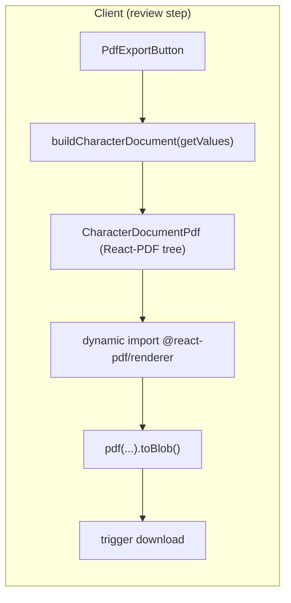

# M1-F13 — Export PDF: Technical Design

## 1. Context

- **Input:** `CharacterDocument` from `buildCharacterDocument()` in `src/lib/character-form/document-sections.ts` (same as M1-F10 preview, M1-F11 Markdown, M1-F12 plain text).
- **Surface:** Review step (`step.id === "review"`) in `character-form-wizard.tsx`, next to `MarkdownExportButton` and `PlainTextExportButton`.
- **Library:** `@react-pdf/renderer` ^4.4.0 (already in `package.json`).
- **Constraint:** Client-only; no API routes for PDF. Generation must not run during SSR or in a server bundle path that executes React-PDF.

## 2. Architecture Overview

- **No new canonical logic:** PDF layout maps `CharacterDocument` → React-PDF `Document` / `Page` / `View` / `Text`. Section presence, order, and block types are driven only by `doc.sections` and `doc.header`; do not read `CharacterFormValues` inside the PDF module except indirectly via the already-built document.

## 3. Module Layout (proposed)

| Artifact | Responsibility |
| --- | --- |
| `src/lib/character-form/document-filename.ts` (new) | Shared `slugifyCharacterDocumentBasename(doc)` or `slugifyBasename(characterName: string)` + `characterDocumentPdfFilename(doc)` — refactor Markdown and plain-text exports to import from here so `.md`, `.txt`, `.pdf` stay aligned (spec note). |
| `src/lib/character-form/document-pdf.tsx` (new) | `CharacterDocumentPdf` React-PDF component tree + `StyleSheet` definitions; maps `DocumentBlock` variants to PDF primitives (mirrors preview semantics, not Tailwind visuals). |
| `src/lib/character-form/generate-character-pdf.ts` (new, optional split) | Thin wrapper: `async function generateCharacterPdfBlob(doc: CharacterDocument): Promise<Blob>` using dynamic `import('@react-pdf/renderer')` and `pdf(<CharacterDocumentPdf document={doc} />).toBlob()` — keeps `@react-pdf/renderer` off the static import graph of unrelated routes. |
| `src/components/character-form/pdf-export-button.tsx` (new) | Client button: disabled when `doc.isEmpty`; loading state; error toast/inline message; calls generator and downloads with `characterDocumentPdfFilename(doc)`. |

Rationale: Colocating `CharacterDocumentPdf` under `lib/character-form/` keeps document serialization (markdown, plain text, PDF) parallel and testable without pulling in shadcn.

## 4. Next.js App Router & Bundling

1. **`PdfExportButton`** is a `"use client"` component (like other export buttons).
2. **Dynamic import:** Inside the click handler (or a lazy-loaded helper), `const { pdf } = await import('@react-pdf/renderer')` before calling `pdf(...)`. Avoid top-level `import from '@react-pdf/renderer'` in files that are imported by server components or large shared chunks if the build pulls it in eagerly—verify with `next build` and bundle analyzer if needed.
3. **`document-pdf.tsx`:** May import `Document`, `Page`, `View`, `Text`, `StyleSheet`, `Font` from `@react-pdf/renderer`. If the bundler still includes React-PDF in the main chunk because `document-pdf.tsx` is statically imported from the button, prefer:
   - either dynamic import of the entire PDF document component + generator in one dynamically loaded module, or
   - keep `CharacterDocumentPdf` in a file that is **only** imported from the dynamically imported module.

   **Recommended pattern:** Single dynamically imported module, e.g. `generate-character-pdf.ts`, that internally imports `CharacterDocumentPdf` from `document-pdf.tsx`, so the wizard page’s initial JS does not contain React-PDF until the user interacts (or until the dynamic chunk prefetches—acceptable).

4. **Production build:** Run `pnpm build` (or `npm run build`) and confirm no React-PDF-related errors from RSC boundaries.

## 5. Visual & Semantic Parity (vs preview)

| Preview (`document-preview.tsx`) | PDF approach |
| --- | --- |
| Title: character name or italic “Sem nome” | Large title `Text`; use muted styling or italic font for “Sem nome” when `!header.characterName.trim()` |
| “por {playerName}” | Smaller body text below title |
| Meta line: values joined ` · ` | Italic or secondary style |
| Section `h3` | Section heading style (fontSize, marginTop, marginBottom) |
| Block `text`: label + body | Label bold/small caps vs body |
| Block `tags`: chips | Inline `Text` with separators or bullet list (chips are not native in React-PDF; use bullets or comma-separated) |
| Block `entries`: list | `View` + bullet `Text` lines; primary bold, secondary, detail indented (match hierarchy) |
| Block `note`: heading + `whitespace-pre-line` body | Subheading + `Text` with preserved line breaks |

**Empty document:** Button disabled; never call `pdf()` when `isEmpty` (matches Markdown/TXT).

**Unnamed character:** PDF must still open with a readable title (aligned with preview “Sem nome”, not a blank header).

## 6. Typography, Pagination, Portuguese (PDF-04, PDF-05)

- **Page:** A4 (or Letter) with consistent margins (e.g. 48–56 pt).
- **Wrap / multipage:** Rely on React-PDF text wrapping; avoid fixed heights on body containers. Long paragraphs and notes should flow across pages.
- **Orphan headings (soft):** Where supported, wrap section title + first block in a `View` with `minPresenceAhead` (React-PDF layout prop) to reduce titles alone at page bottom—best-effort only.
- **Long unbroken strings:** Prefer `wrap` / break opportunities; if needed, `hyphenationCallback` or manual splitting is a last resort (edge case in spec).
- **Fonts:** Default built-in fonts may not cover all Latin Extended / Portuguese glyphs reliably. **Register** a Unicode-capable font (e.g. **Noto Sans** via `Font.register({ family: 'NotoSans', src: 'https://...' })`) and use it for all user-facing text. Verify `São Paulo`, `ação`, `coração`. Emoji: document that missing glyphs may omit or show tofu without crashing (try/catch around generation already required for failures).

## 7. UX: Loading, Errors, Double-Click (edge cases)

- **Loading:** Disable button or show spinner while `pdf().toBlob()` is in flight; guard with a ref or state flag so rapid double-clicks do not leave permanent loading (queue/cancel or ignore second click until settle).
- **Errors:** `try/catch` around generation + download; show toast (if project has sonner/toast) or inline alert consistent with future export patterns—must not throw to React error boundary.
- **Filename:** `${slugifyBasename(doc.header.characterName)}.pdf` with same rules as Markdown (whitespace-only name → `personagem`).

## 8. Testing Strategy (lightweight, per spec)

- **Unit / integration:** Fixture `CharacterDocument` (minimal + multi-section) → render pipeline completes: dynamic import + `pdf()` resolves without throw, or snapshot a stable substring if testing internals.
- **Manual / E2E (optional):** Playwright on `/criar` review: click PDF, expect download event with `.pdf` extension—only if the suite already handles downloads.

## 9. Requirement Mapping

| ID | Design coverage |
| --- | --- |
| PDF-01 | `PdfExportButton` on review step; download blob; disabled `isEmpty`; shared filename helper |
| PDF-02 | `CharacterDocumentPdf` iterates `doc.sections` only; maps block types; header unnamed case |
| PDF-03 | Client-only + dynamic import + build verification + error handling |
| PDF-04 | Styles, margins, wrapping, multipage, optional `minPresenceAhead` |
| PDF-05 | `Font.register` + Noto (or equivalent) for pt-BR text |

## 10. Open Decisions (resolve during implementation)

- Exact font source: Google Fonts CDN URL vs bundling a `.ttf` in `public/` (offline / CSP considerations for static export hosting).
- Whether to extract a shared “block content” visual spec in comments next to preview for future drift control (optional).
