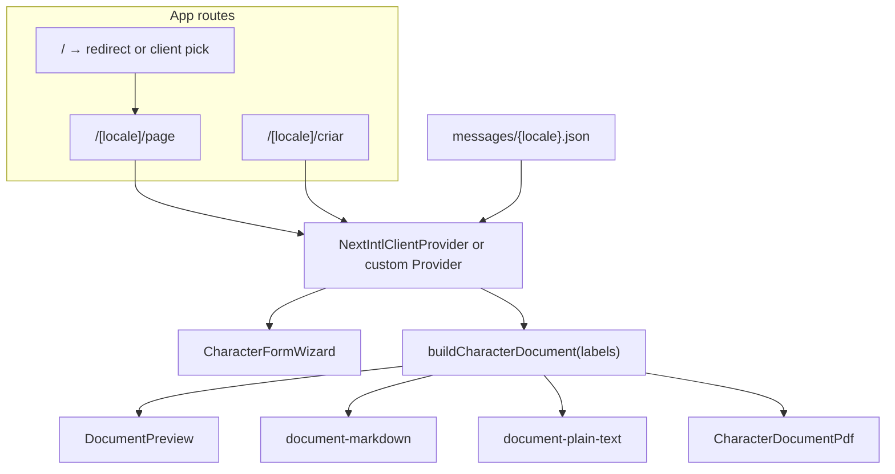

# M2-F02 — i18n: Technical Design

## 1. Context

- **Stack:** Next.js **16** App Router, **`output: "export"`**, optional `basePath` / `assetPrefix` for GitHub Pages (`NEXT_BASE_PATH`).
- **Today:** No i18n library; `lang="pt-BR"` fixed in `src/app/layout.tsx`; copy scattered across `page.tsx`, `steps.ts`, `schema.ts`, field components, `document-sections.ts`, preview, export modules, PDF, layout metadata.
- **Constraint:** Static hosting does **not** run Next.js **middleware** or server redirects per request. Any locale routing must be **pre-rendered** or handled **client-side** without assuming edge/runtime.

## 2. Goals of this design

1. Satisfy **I18N-01–I18N-05** in `spec.md`.
2. Minimize duplicate copy between **preview / Markdown / plain text / PDF** by driving document chrome from the same translation layer as the app where feasible.
3. Keep **default locale `pt-BR`** and product positioning unchanged.

## 3. Recommended approach: locale segment + message dictionaries

### 3.1 Routing

Use a **dynamic segment** `[locale]` under `src/app/` for all localized pages:

- `src/app/[locale]/layout.tsx` — wraps `ThemeProvider`, `AppShell`, **i18n provider**, sets `<html lang={...}>`.
- `src/app/[locale]/page.tsx` — home / marketing.
- `src/app/[locale]/criar/page.tsx` — wizard (move from current `src/app/criar/page.tsx`).

**Static generation:** Export `generateStaticParams()` returning `[{ locale: 'pt-BR' }, { locale: 'en' }]` from a shared helper so every localized layout/page is built twice.

**Root URL:** Replace the current root `src/app/page.tsx` with a minimal route that **redirects** to the default locale:

- Prefer **`redirect(`/`/${defaultLocale}`)`** from `next/navigation` in a server component **if** static export emits a valid default entry (verify during implementation; Next’s static export behavior for `redirect` must be validated in this repo’s Next 16 version).
- **Fallback if redirect is unsuitable for static export:** a tiny **client** root page that runs one-time `window.location.replace(\`/${preferredLocale}/\`)` where `preferredLocale` comes from `localStorage` or defaults to `pt-BR`. Spec allows brief flash; this fallback is acceptable.

**Link component:** Use a thin wrapper (e.g. `Link` from `next/link` with pathname prefixed by current locale) or **`next-intl`’s `Link`** if that library is adopted — so `basePath` + locale combine correctly.

### 3.2 Library choice

**Primary recommendation: `next-intl`**

- Mature App Router integration, `useTranslations`, ICU messages, type-safe keys (optional).
- Works with **static export** when all locales are listed in `generateStaticParams` and middleware is **not required** for the chosen setup (use **[locale] segment only**; avoid middleware-dependent features for GitHub Pages).

**Alternative:** Custom `React.Context` + JSON files + hook `useT()` — fewer dependencies, more manual plumbing for `Link`, `lang`, and server metadata.

**Decision record in implementation:** If `next-intl` conflicts with static export or `basePath`, document the blocker in STATE and fall back to custom provider; either way, message files remain the source of truth.

### 3.3 Message file layout

Place JSON (or TS objects) under e.g. `messages/pt-BR.json` and `messages/en.json` (exact path per project convention).

Suggested **top-level namespaces** (adjust as needed):

| Namespace | Contents |
| --- | --- |
| `meta` | Site title template, default description (for `generateMetadata` per locale) |
| `home` | Landing hero, cards, CTAs |
| `shell` | Header nav, theme toggle aria, footer if any |
| `steps` | Wizard step `title` / `description` keyed by `FormStepId` |
| `fields` | Field labels, placeholders, section headings in form UI |
| `validation` | Zod error messages — **either** interpolate from keys in schema **or** central string table consumed by schema factory `createSchema(t)` |
| `export` | Button labels, short descriptions, errors |
| `document` | Section titles, block labels, “unnamed character” placeholder, strings currently inside `document-sections` / preview / exporters |
| `common` | Shared buttons: Next, Back, Reset, etc. |

**Single source for document chrome:** Refactor `buildCharacterDocument()` (and consumers) to accept a **getter** `tDocument(key)` or a **prebuilt `DocumentLabels` object** from the active locale, so Markdown, plain text, PDF, and preview do not fork English/Portuguese literals.

### 3.4 Zod validation

Today `schema.ts` embeds Portuguese strings. Options:

1. **`createCharacterFormSchema(messages: ValidationMessages)`** factory returning the same Zod shape with localized `.min()`, `.superRefine()`, etc. messages.
2. **Error map** / i18n layer that maps issue codes → translated strings (more indirection).

Prefer **(1)** for clarity and testability: unit tests call the factory with fixture messages in English and assert error text.

### 3.5 `FORM_STEPS` metadata

`src/lib/character-form/steps.ts` should expose **step ids and numeric order only** (or English-neutral ids), with **titles/descriptions** supplied from messages using `step.id` as key. Keep `steps.test.ts` aligned (test ids and count, not literal Portuguese titles).

### 3.6 Locale persistence

- Store `locale` in **`localStorage`** (e.g. key `meu-background-locale`) when user switches language.
- On navigation from root redirect or layout mount, read preference and ensure URL matches (if user bookmarked `/pt-BR/criar` but prefers `en`, optional **sync** on load — **P2**; P1 only requires switcher + persistence + static paths work).

**Important:** Do **not** store locale inside Zustand character persist slice — avoids coupling draft migration to language.

### 3.7 Metadata (SEO)

Per-locale `generateMetadata` in `[locale]/layout.tsx` using translated `meta` strings. Full Open Graph / Twitter parity is **M2-F05**; this feature should at least set **title** and **description** per locale.

### 3.8 Cypress / Vitest

- **Vitest:** Test that `pt-BR` and `en` message JSON have the **same key tree** (deep compare of keys); optionally snapshot count of keys.
- **Vitest:** `createCharacterFormSchema` with English messages returns English error for a known violation.
- **Cypress (optional):** Visit `/en/criar` (with `basePath` baseUrl config if needed), assert one stable `data-testid` element’s text or `lang` attribute — avoid testing every string.

### 3.9 Constants (origin countries, chips)

- If option labels are **editorial UI** (country list, temperament tags), load label from messages or a `const OPTIONS: Record<Locale, ...>` colocated with constants.
- If a value is a **proper name** in all locales, keep one string; document exception in STATE if any.

## 4. Architecture sketch

## 5. Migration checklist (implementation order)

1. Add `[locale]` segment + `generateStaticParams`; move pages; fix internal links.
2. Add message files + provider; migrate **layout/shell/home** strings.
3. Migrate **steps** + wizard chrome; then **field** components.
4. Introduce **schema factory** + migrate validation strings; update `schema.test.ts`.
5. Thread **document labels** through `buildCharacterDocument` + preview + three exports; update document tests.
6. Add **locale switcher** UI (header or settings popover) + `localStorage`.
7. Add **key-parity** test + minimal E2E for `/en` route.
8. Run `npm run build` with and without `NEXT_BASE_PATH`; fix asset/link issues.

## 6. Requirement mapping

| ID | Design coverage |
| --- | --- |
| I18N-01 | Locale switcher, persistence, `[locale]` routes, no draft reset |
| I18N-02 | `generateStaticParams`, static export smoke, `basePath`-aware links |
| I18N-03 | Namespaces + schema factory + document label threading |
| I18N-04 | `<html lang>` from active locale in `[locale]/layout` |
| I18N-05 | Vitest key-tree parity + schema locale test |

## 7. Open decisions (resolve during implementation)

- **Library:** `next-intl` vs custom context (validate static export + Next 16 first).
- **Root redirect:** Server `redirect` vs client fallback for GitHub Pages `index.html`.
- **Exact locale codes:** URL segment `pt-BR` vs `pt` — prefer **`pt-BR`** to match `lang` and product.
- **Filenames:** Whether empty-name basename uses translated word per locale (spec edge case).
